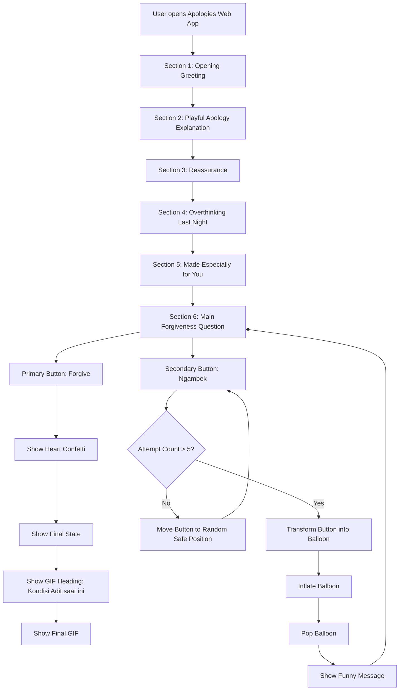
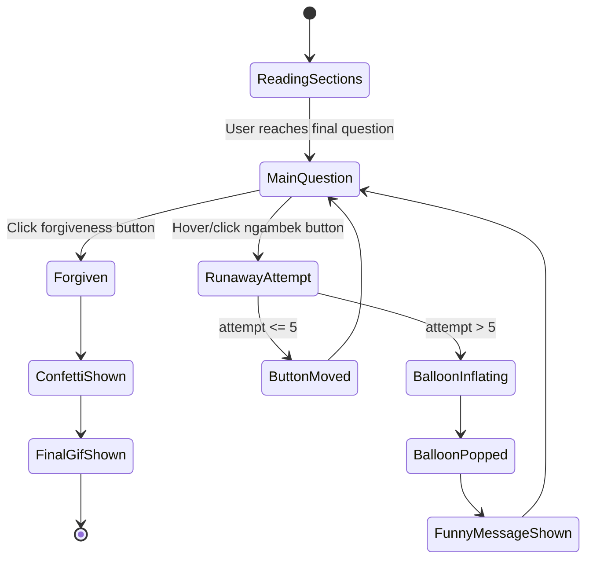
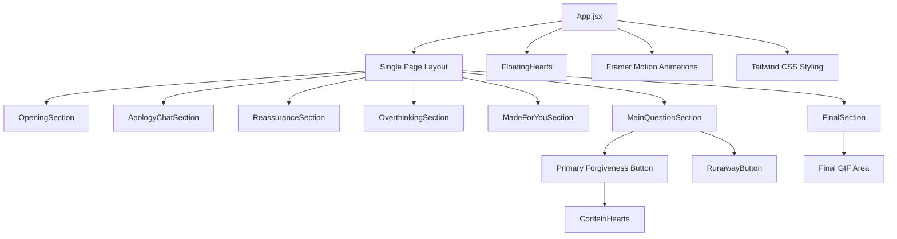
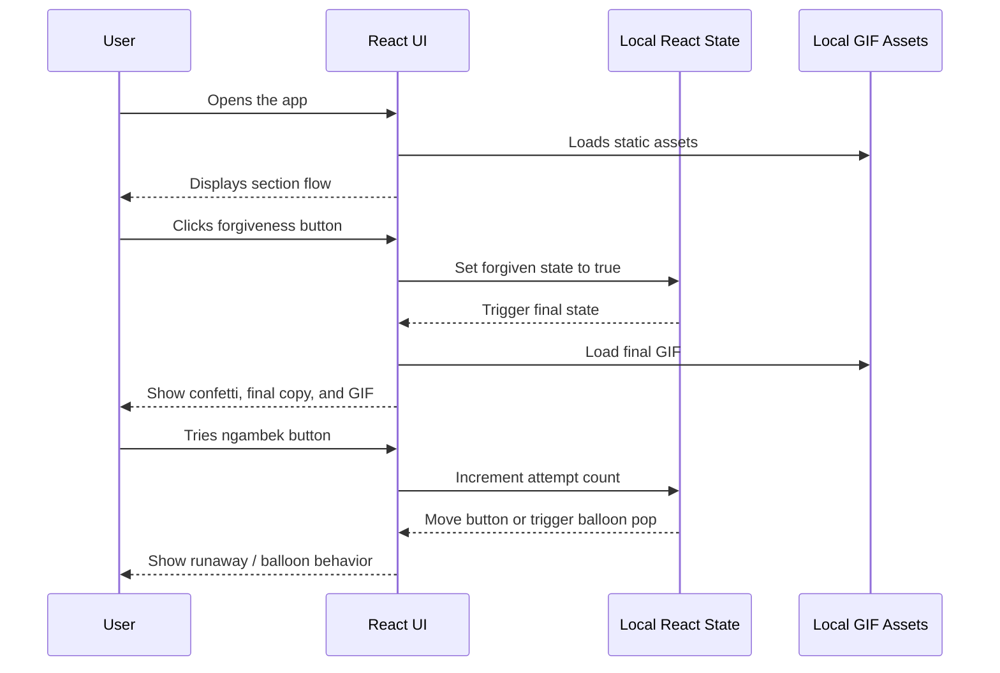
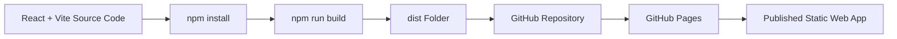

# PRD: Apologies Web App

## Document Info

| Field | Value |
|---|---|
| Document status | Final for MVP implementation |
| Product / Project name | Apologies Web App |
| Repository slug | `apologies-web-app` |
| Primary audience | AI coding agent and product owner |
| Owner | Aditya |
| Primary user | Stasya |
| Platform | Static web app |
| Tech stack | React + Vite, Tailwind CSS, Framer Motion |
| Deployment target | GitHub Pages |
| Last updated | 2026-07-03 |
| Language of PRD | English |
| Language of app copy | Indonesian |

---

## 1. Summary

**Apologies Web App** is a single-page React web app designed as an interactive apology letter for Stasya. The app should feel **soft romantic, cute, playful, slightly funny, and sincere**. It guides Stasya through a six-section emotional flow: greeting, apology context, reassurance, overthinking, reveal of the web app effort, and a final forgiveness question.

The MVP must be built from scratch using **React + Vite**, styled with **Tailwind CSS**, animated with **Framer Motion**, and deployable as a static site on **GitHub Pages**.

The core interaction is the final question with two buttons:

1. A primary forgiveness button that reveals the final thank-you state, heart confetti, and a GIF area with the text **“Kondisi Adit saat ini”**.
2. A playful “ngambek” button that runs away when hovered or clicked, then turns into an inflated balloon and pops after more than five attempts.

---

## 2. Problem

Aditya wants to apologize to Stasya in a more personal and effortful way than a normal chat message. The situation happened because Aditya intended to joke by pretending to be upset, but Stasya became genuinely upset. The apology should communicate that Aditya understands the mistake, does not feel disturbed by Stasya, and wants to make Stasya smile again without making the experience feel overly formal or emotionally heavy.

---

## 3. Goals

| ID | Goal | Target |
|---|---|---|
| G-01 | Deliver a personal apology experience | Stasya can read the apology from start to final state in one continuous flow |
| G-02 | Balance sincerity and playfulness | The app feels cute and funny while still clearly expressing regret |
| G-03 | Provide a responsive experience | The app is usable on mobile, tablet, and desktop |
| G-04 | Make implementation clear for an AI coding agent | Scope, requirements, validation, file boundaries, and stop conditions are explicit |
| G-05 | Support static deployment | The app can be built as static assets and deployed to GitHub Pages |

---

## 4. Non-goals / Do Not Implement

| ID | Non-goal / Do Not Implement | Reason |
|---|---|---|
| NG-01 | Backend API | Not required for MVP |
| NG-02 | Database | No data persistence is needed |
| NG-03 | Authentication or login | This is a personal static web app |
| NG-04 | CMS for editing copy | MVP copy is hardcoded |
| NG-05 | External GIF API | GIF assets will be provided manually by the user |
| NG-06 | Optional “Aku masih butuh waktu dulu” link | Explicitly excluded from MVP |
| NG-07 | Analytics or personal tracking | Not needed and could create privacy concerns |
| NG-08 | Server-side rendering | Static client-side app is sufficient |
| NG-09 | Multi-page routing | Single-page vertical flow is required |
| NG-10 | Audio or background music | Not requested for MVP |

---

## 5. Target User / Persona

| Field | Value |
|---|---|
| Primary user | Stasya |
| User context | Stasya receives and opens a personal apology web app |
| User goal | Understand the apology, feel reassured, and optionally forgive Aditya |
| Emotional need | The experience should feel sincere, safe, cute, and not forceful |
| Device expectation | Mobile-first, but also usable on desktop |
| Secondary user | Aditya, as the creator and owner of the apology app |

---

## 6. Scope

### 6.1 In Scope

- Create a new React project using Vite.
- Configure Tailwind CSS.
- Configure Framer Motion.
- Build a single-page vertical scroll experience.
- Implement six main sections:
  1. Opening Greeting.
  2. Playful Apology Explanation.
  3. Reassurance.
  4. Overthinking Last Night.
  5. Made Especially for You.
  6. Main Forgiveness Question.
- Implement final state after the forgiveness button is clicked.
- Display final GIF area with the text **“Kondisi Adit saat ini”** above the GIF.
- Support local GIF assets provided by the user.
- Implement smooth scroll.
- Implement lightweight animations:
  - section fade-in;
  - staged text reveal or typewriter effect;
  - floating hearts;
  - chat typing indicator;
  - blinking stars;
  - Framer Motion transitions;
  - heart confetti;
  - runaway button;
  - balloon inflate and pop animation.
- Ensure responsive design for mobile, tablet, and desktop.
- Prepare the project for GitHub Pages static deployment.

### 6.2 Out of Scope

- Backend.
- Database.
- User accounts.
- Admin dashboard.
- GIF upload UI.
- Fetching GIFs from third-party APIs.
- Optional honest link.
- External analytics.
- Server-side rendering.
- Complex routing.
- Production secret management.

---

## 7. Execution Context

| Field | Value |
|---|---|
| Project setup | Create a new project from scratch |
| Command baseline | `npm create vite@latest apologies-web-app -- --template react` |
| Framework | React |
| Build tool | Vite |
| Styling | Tailwind CSS |
| Animation library | Framer Motion |
| Deployment target | GitHub Pages |
| Repository slug | `apologies-web-app` |
| Vite base path | `/apologies-web-app/` for GitHub Pages project page deployment |
| Asset source | Local GIF files provided by the user |
| Main GIF location | `public/gifs/` |
| Final GIF placeholder name | `final-adit.gif` |
| Human approval required | Yes, for final GIF replacement and final copy review |
| External services | None |

---

## 8. Design Direction

### 8.1 Visual Style

| Element | Direction |
|---|---|
| Mood | Soft romantic, cute playful, sincere, slightly comedic |
| Layout | One-page vertical scroll, full-screen sections, centered card layout |
| Backgrounds | Soft cream, light pink, lavender, peach, and night gradient for overthinking section |
| Card style | Large rounded cards, soft shadows, warm spacing |
| Decorative elements | Small hearts, stars, clouds, doodles, stickers, and local GIFs |
| Animation style | Slow, soft, subtle, and not visually overwhelming |
| Emotional target | “I am seriously sorry, but I still want to make you smile.” |

### 8.2 Color Palette

```text
Background: #FFF7F0 / #FFF1F5
Primary: #FF8FAB
Secondary: #B388EB
Text: #3A2E39
Accent: #FFD6E0
Button: #FF5C8A
```

### 8.3 Typography

Recommended font pairing:

```text
Heading: Baloo 2
Body: Nunito
Accent / handwritten: Patrick Hand
```

If the implementation loads fonts from an external provider, it must include fallback fonts and must not block the main UI from rendering.

---

## 9. Content Requirements

The PRD is written in English, but the app copy must remain in Indonesian because the product is personal and intended for Stasya.

### 9.1 Section 1 — Opening Greeting

**Purpose:** Open the experience with a sweet, personal greeting.

**Copy:**

```text
Halo, kakak cantik,
Stasya Annesty.

Hmm… kamu masih marah ya?
```

**UI requirements:**

- Show a large rounded digital-letter card in the center.
- Show a small heading: `Untuk Kakak Cantik`.
- Reveal text using staged reveal or typewriter-like animation.
- Add soft floating hearts.
- Support an optional local GIF/illustration.
- Show CTA button: `Iya, lanjut baca dulu…`.

---

### 9.2 Section 2 — Playful Apology Explanation

**Purpose:** Explain that Aditya’s joke was wrong without making the section too heavy.

**Copy:**

```text
Aku tadi niatnya bercanda…
Aku cuma pura-pura ngambek…
Tapi ternyata kamu yang beneran ngambek…
Dan aku kalah.
```

**Additional copy:**

```text
Maaf ya…
```

**UI requirements:**

- Use chat bubble layout.
- Include a temporary typing indicator bubble with `...`.
- Animate the appearance of chat bubbles with Framer Motion.
- Keep tone apologetic, playful, and not defensive.

---

### 9.3 Section 3 — Reassurance

**Purpose:** Reassure Stasya that Aditya is not annoyed by her stories, random questions, or requests.

**Heading:**

```text
Aku nggak pernah keganggu sama kamu.
```

**Copy:**

```text
Aku nggak kesel karena kamu banyak ngomong.
Aku justru senang waktu kamu cerita, nanya hal random,
atau nge-request apa pun ke aku.
```

**Card items:**

```text
💬 Kamu cerita
❓ Kamu nanya random
📝 Kamu request sesuatu
🤍 Aku merasa berguna buat kamu
```

**UI requirements:**

- Use a calmer background than the playful sections.
- Display four small reassurance cards.
- Keep this section warm and emotionally sincere.

---

### 9.4 Section 4 — Overthinking Last Night

**Purpose:** Show Aditya’s effort and overthinking in a cute and personal way.

**Copy:**

```text
Dari semalam aku kepikiran terus sampai susah tidur, hehe.
Iya, aku overthinking sendiri karena takut kamu masih marah sama aku.

Terus akhirnya aku bikin ini deh.
```

**Thought bubbles:**

```text
Dia masih marah nggak ya?
Aduh aku salah…
Gimana cara minta maaf yang lucu ya?
Bikin web aja deh…
```

**UI requirements:**

- Use a night-themed background with stars.
- Animate subtle blinking stars.
- Show thought bubbles one by one.
- Support a local GIF showing overthinking/sleepless/cute character.
- Show CTA button: `Lihat hasil overthinking-ku`.

---

### 9.5 Section 5 — Made Especially for You

**Purpose:** Reveal that the web app itself is the result of Aditya’s effort.

**Heading:**

```text
Aku bikin ini khusus buat kamu.
```

**Copy:**

```text
Aku harap hal kecil ini bisa bikin marah kamu sedikit reda,
bikin kamu senyum lagi,
dan bikin kamu mau maafin aku.
```

**Loading copy:**

```text
Apology loading...
[██████████] 100%
Status: masih berharap dimaafin kakak cantik
```

**UI requirements:**

- Show a small laptop/card visual.
- Animate loading progress from “loading apology…” to “done”.
- Support a local GIF related to coding, hearts, or cute effort.

---

### 9.6 Section 6 — Main Forgiveness Question

**Purpose:** Serve as the emotional climax and main interaction point.

**Copy:**

```text
Jadi…

Mau ya?

Maafin aku.

Maafin Aditya Ardiansyah Ramadhan ini.
```

**Primary button copy:**

```text
Iya deh, aku maafin kamu.
Tapi jangan ngelakuin hal itu lagi ya ke aku.
```

**Secondary button copy:**

```text
Nggak mau, aku mau ngambek seminggu lagi.
```

**UI requirements:**

- Use full-screen pink gradient background.
- Show floating hearts.
- Place the main card in the center.
- Make the primary button visually dominant.
- Make the secondary button visible but less prominent.

---

### 9.7 Final State — After Forgiveness

**Trigger:** User clicks the primary forgiveness button.

**Final copy:**

```text
Yeay…

Makasih ya, kakak cantik.

Aku senang banget kamu mau maafin aku.
Aku janji bakal lebih hati-hati,
lebih peka,
dan nggak pura-pura ngambek dengan cara yang bikin kamu sedih lagi.
```

**Final GIF heading:**

```text
Kondisi Adit saat ini
```

**UI requirements:**

- Trigger heart confetti when final state appears.
- Show the text `Kondisi Adit saat ini` above the final GIF.
- Show the final GIF from local assets.
- If the final GIF is not available during development, use a placeholder and alt text.
- Do not add a WhatsApp link.
- Do not add optional “Aku masih butuh waktu dulu” link.

---

## 10. Feature Flow

### 10.1 Step-by-step Flow

```text
User opens Apologies Web App
→ Section 1 shows the greeting for Stasya
→ User scrolls or clicks the continue button
→ Section 2 explains that Aditya was wrong for joking this way
→ Section 3 reassures Stasya that she is not annoying or disturbing
→ Section 4 shows Aditya overthinking last night
→ Section 5 reveals that this web app was made especially for Stasya
→ Section 6 shows the main forgiveness question
→ User chooses the forgiveness button or the runaway “ngambek” button
→ If user clicks the forgiveness button: show final state, heart confetti, and final GIF area
→ If user tries the “ngambek” button: move the button to a random safe position
→ If the user tries the “ngambek” button more than five times: turn the button into a balloon, inflate it, and pop it
→ After the pop animation: show a funny message and keep the user in the main question section
```

### 10.2 Mermaid — User Flow



### 10.3 Mermaid — Interaction State Diagram



---

## 11. Component / System Context

### 11.1 Recommended Component Structure

```text
apologies-web-app/
  public/
    gifs/
      final-adit.gif
      opening.gif
      overthinking.gif
      made-for-you.gif
  src/
    components/
      SectionWrapper.jsx
      OpeningSection.jsx
      ApologyChatSection.jsx
      ReassuranceSection.jsx
      OverthinkingSection.jsx
      MadeForYouSection.jsx
      MainQuestionSection.jsx
      FinalSection.jsx
      FloatingHearts.jsx
      ConfettiHearts.jsx
      RunawayButton.jsx
    App.jsx
    main.jsx
    index.css
  index.html
  package.json
  vite.config.js
```

The AI coding agent may adjust file names if necessary, but the final code must remain modular and easy to review.

### 11.2 Mermaid — Component Diagram



### 11.3 System / Sequence Flow

Because this MVP has no backend, database, API, or external service, the system sequence is purely client-side.



---

## 12. Deployment Context

### 12.1 Static Deployment Requirement

The app must be deployable as a static site. GitHub Pages is suitable because it hosts static HTML, CSS, and JavaScript files from a GitHub repository. Vite is suitable because it builds the React app into static production assets in the `dist` folder.

### 12.2 GitHub Pages Project Page Configuration

If the GitHub repository is named:

```text
apologies-web-app
```

and the published URL follows this pattern:

```text
https://<username>.github.io/apologies-web-app/
```

then `vite.config.js` must include:

```js
import { defineConfig } from 'vite'
import react from '@vitejs/plugin-react'

export default defineConfig({
  base: '/apologies-web-app/',
  plugins: [react()],
})
```

If the project is deployed to a root user page or custom domain, the `base` value must be adjusted accordingly.

### 12.3 Mermaid — Deployment Flow



---

## 13. Architecture Impact

| Area | Impact |
|---|---|
| API | No API |
| Database | No database |
| Security | No auth, credential, secret, payment, or sensitive transaction |
| Privacy | Personal names are displayed; avoid sharing the public URL broadly if privacy is a concern |
| Observability | No production observability required; remove debug console logs before final delivery |
| Performance | GIFs and animations must remain lightweight enough for mobile |
| Accessibility | Text must be readable and primary actions must be easy to click/tap |
| Backward compatibility | Not applicable because this is a new project |
| Routing | Single-page app; React Router is not required |
| Deployment | Static deployment to GitHub Pages |

---

## 14. Functional Requirements

| ID | Requirement | Priority | Acceptance Criteria |
|---|---|---|---|
| FR-01 | Create a new React project using Vite. | Must-have | The project runs locally with `npm run dev`. |
| FR-02 | Configure Tailwind CSS for styling. | Must-have | UI styling is implemented using Tailwind classes/configuration. |
| FR-03 | Configure Framer Motion for animations. | Must-have | Main transitions or interaction animations use Framer Motion. |
| FR-04 | Implement a single-page layout with six main sections. | Must-have | All six sections render in order and are reachable through scroll. |
| FR-05 | Implement Opening Greeting section. | Must-have | The greeting copy appears in a digital-letter card with soft animation. |
| FR-06 | Implement Playful Apology Explanation section. | Must-have | Chat bubbles, typing indicator, and apology copy are displayed. |
| FR-07 | Implement Reassurance section. | Must-have | Heading and four reassurance cards are displayed. |
| FR-08 | Implement Overthinking Last Night section. | Must-have | Night background, stars, and thought bubbles are displayed. |
| FR-09 | Implement Made Especially for You section. | Must-have | Reveal copy and apology loading/progress UI are displayed. |
| FR-10 | Implement Main Forgiveness Question section. | Must-have | Main copy and both buttons are displayed. |
| FR-11 | Implement forgiveness button behavior. | Must-have | Clicking the primary button shows final state without page reload. |
| FR-12 | Implement heart confetti on forgiveness. | Must-have | Confetti appears when final state is triggered. |
| FR-13 | Implement final GIF area. | Must-have | Text `Kondisi Adit saat ini` appears above the final GIF. |
| FR-14 | Support local GIF assets. | Must-have | GIFs load from project assets/public folder and do not break layout. |
| FR-15 | Implement runaway behavior for the ngambek button. | Must-have | Hovering or clicking the button moves it to a random safe position. |
| FR-16 | Track ngambek button attempts. | Must-have | Attempt counter increments when the user tries to interact with the button. |
| FR-17 | Trigger balloon pop after more than five attempts. | Must-have | Button transforms into a balloon, inflates, pops, and shows a funny message. |
| FR-18 | Implement smooth scroll between sections. | Must-have | Continue buttons or section navigation scroll smoothly. |
| FR-19 | Ensure responsive layout. | Must-have | The app remains readable and usable on mobile, tablet, and desktop. |
| FR-20 | Exclude optional “Aku masih butuh waktu dulu” link. | Must-have | The optional link does not appear in MVP. |
| FR-21 | Prepare static build for GitHub Pages. | Must-have | `npm run build` completes and produces a deployable `dist` folder. |

---

## 15. Non-functional Requirements

| ID | Category | Requirement | Target / Acceptance Criteria |
|---|---|---|---|
| NFR-01 | Performance | App must remain lightweight despite GIFs and animations. | No obvious lag during manual QA on mobile viewport. |
| NFR-02 | Responsiveness | Layout must be mobile-first and responsive. | All sections remain readable on mobile, tablet, and desktop. |
| NFR-03 | Accessibility | Copy and buttons must be readable and tappable. | Adequate contrast, readable font size, and comfortable touch targets. |
| NFR-04 | Motion safety | Animations must not be too fast or aggressive. | No extreme flashing or motion that disrupts reading. |
| NFR-05 | Maintainability | Code should be modular by section/component. | Main components are separated and easy to review. |
| NFR-06 | Deployment compatibility | Build must work for GitHub Pages. | Vite base path is correct for the repository URL. |
| NFR-07 | Privacy | Personal copy should remain intentionally shared. | No analytics, forms, or collection of user data. |

---

## 16. Implementation Plan

| Phase | Objective | Output | Validation |
|---|---|---|---|
| Phase 0 — Project Setup | Create React + Vite project and install required dependencies. | Running local React app | `npm run dev` works |
| Phase 1 — Styling Foundation | Configure Tailwind CSS and global visual tokens. | Base theme, colors, spacing, typography | UI renders with Tailwind |
| Phase 2 — Section Layout | Build six sections and final state component. | Full page structure | Manual section flow check |
| Phase 3 — Core Interactions | Implement forgiveness button, final state, confetti, runaway button, and attempt counter. | Main interactions working | Manual interaction QA |
| Phase 4 — Animation Polish | Add Framer Motion transitions, balloon pop, floating hearts, and subtle effects. | Playful animated experience | Manual animation QA |
| Phase 5 — Asset Integration | Add GIF asset support and final GIF placeholder/replacement. | GIFs visible and responsive | Manual asset QA |
| Phase 6 — Build & Deployment Prep | Configure Vite base path and validate static build. | GitHub Pages-ready app | `npm run build` passes |

---

## 17. Task Breakdown

| Task ID | Phase | Objective | Related Requirement | Files / Area | Validation |
|---|---|---|---|---|---|
| TASK-01 | Phase 0 | Create Vite React project. | FR-01 | Root project | `npm run dev` |
| TASK-02 | Phase 0 | Install and configure Tailwind CSS. | FR-02 | `src/index.css`, config files | UI uses Tailwind |
| TASK-03 | Phase 0 | Install Framer Motion. | FR-03 | `package.json` | App builds |
| TASK-04 | Phase 1 | Define global layout, colors, and typography. | NFR-02, NFR-03 | `src/index.css`, components | Visual review |
| TASK-05 | Phase 2 | Build all six sections. | FR-04 to FR-10 | `src/components/*` | Manual section flow |
| TASK-06 | Phase 3 | Implement forgiveness final state. | FR-11 to FR-13 | `MainQuestionSection`, `FinalSection` | Click primary button |
| TASK-07 | Phase 3 | Implement runaway button. | FR-15, FR-16 | `RunawayButton.jsx` | Hover/click button |
| TASK-08 | Phase 4 | Implement balloon inflate and pop. | FR-17 | `RunawayButton.jsx` | More than five attempts |
| TASK-09 | Phase 4 | Add motion transitions and visual effects. | FR-03, NFR-04 | Components | Manual animation QA |
| TASK-10 | Phase 5 | Add local GIF support. | FR-14 | `public/gifs/` | GIF renders |
| TASK-11 | Phase 6 | Configure Vite base path for GitHub Pages. | FR-21 | `vite.config.js` | `npm run build` |
| TASK-12 | Phase 6 | Final QA and handover report. | All | Whole app | Validation table completed |

---

## 18. Validation Contract

| Purpose | Command / Method | Required? |
|---|---|---:|
| Install dependencies | `npm install` | Yes |
| Local development | `npm run dev` | Yes |
| Static production build | `npm run build` | Yes |
| Preview production build | `npm run preview` | Recommended |
| Lint | `npm run lint` | If script exists |
| Manual QA — Section flow | Open the app and verify all six sections appear in order | Yes |
| Manual QA — Smooth scroll | Click continue buttons or navigate sections and verify smooth scrolling | Yes |
| Manual QA — Forgiveness button | Click primary button and verify final state appears | Yes |
| Manual QA — Final GIF | Verify `Kondisi Adit saat ini` appears above the final GIF | Yes |
| Manual QA — Runaway button | Hover/click the ngambek button and verify it moves | Yes |
| Manual QA — Balloon pop | Try the ngambek button more than five times and verify balloon pop animation | Yes |
| Manual QA — Responsiveness | Test mobile, tablet, and desktop viewport widths | Yes |
| Manual QA — GitHub Pages path | Verify deployed assets do not return 404 | Yes |

The implementation is not considered complete if any must-have validation fails without a documented explanation.

---

## 19. File / Change Boundary

### 19.1 Allowed to Modify

```text
apologies-web-app/
  public/
  src/
  index.html
  vite.config.js
  package.json
  package-lock.json
  tailwind config files if generated
```

### 19.2 Allowed Asset Folder

```text
public/gifs/
```

### 19.3 Forbidden to Modify

```text
.env
.env.local
.env.production
secrets/*
infra/*
unrelated deployment production config
files outside the Apologies Web App project
```

The AI coding agent must not add secrets, credentials, external API keys, backend services, or a database.

---

## 20. Dependencies

| ID | Dependency | Owner | Status | Notes |
|---|---|---|---|---|
| DEP-01 | React + Vite setup | AI coding agent | Required | Project is created from scratch |
| DEP-02 | Tailwind CSS setup | AI coding agent | Required | Styling must use Tailwind CSS |
| DEP-03 | Framer Motion setup | AI coding agent | Required | Animations must use Framer Motion |
| DEP-04 | Final GIF asset | User | Required before final delivery | Placeholder may be used during development |
| DEP-05 | GitHub repository | User / AI coding agent | Required for deployment | Repository slug: `apologies-web-app` |
| DEP-06 | GitHub Pages configuration | User / AI coding agent | Required for deployment | Base path must match repository URL |
| DEP-07 | Final copy approval | User | Required before delivery | Copy may be polished only with user approval |

---

## 21. Risks & Assumptions

| ID | Type | Description | Impact | Mitigation / Validation |
|---|---|---|---|---|
| RISK-01 | Risk | GIF files are too large. | Mobile performance may suffer. | Use optimized GIFs and test on mobile viewport. |
| RISK-02 | Risk | Animations feel too busy. | Apology may feel less sincere. | Keep animations soft and slow. |
| RISK-03 | Risk | Runaway button exits the viewport. | Interaction becomes broken. | Restrict random positions to a safe container area. |
| RISK-04 | Risk | Vite base path is wrong for GitHub Pages. | Assets may fail to load after deployment. | Set base path to `/apologies-web-app/` for project page deployment. |
| RISK-05 | Risk | Personal names are publicly visible. | Privacy concern. | Share the deployed URL intentionally and avoid analytics/tracking. |
| ASM-01 | Assumption | Repository slug is `apologies-web-app`. | Used for Vite base path. | If repository name changes, update `base`. |
| ASM-02 | Assumption | App does not require backend or data persistence. | Keeps MVP frontend-only. | Covered by out-of-scope section. |
| ASM-03 | Assumption | User will provide final GIF assets. | Placeholder may be temporary. | Replace placeholder before final delivery. |

---

## 22. Stop Conditions

The AI coding agent must stop and ask for clarification if:

- The repository name changes from `apologies-web-app` and the deployment base path becomes unclear.
- The final GIF is unavailable but the user requests final delivery without placeholder.
- A new dependency beyond React, Vite, Tailwind CSS, and Framer Motion is required.
- Any requirement requires backend, database, authentication, analytics, or external API.
- The implementation needs to modify `.env`, secrets, infra, or forbidden files.
- GitHub Pages deployment target changes to root user page or custom domain and base path needs adjustment.
- The balloon pop interaction cannot be made responsive and stable.
- Build fails because of unrelated dependency or environment issues.
- A major copy change is requested that changes the emotional intent of the PRD.

---

## 23. Handover / Final Output

The AI coding agent must provide a final implementation report using the following structure.

### 23.1 Summary

- Project setup completed.
- React + Vite app created.
- Tailwind CSS configured.
- Framer Motion configured.
- Six sections implemented.
- Forgiveness button and final state implemented.
- Final GIF area implemented.
- Runaway button and balloon pop implemented.
- Static build prepared for GitHub Pages.

### 23.2 Requirements Completed

| Requirement ID | Status | Notes |
|---|---|---|
| FR-01 | Done / Partial / Blocked | Notes |
| FR-02 | Done / Partial / Blocked | Notes |
| FR-03 | Done / Partial / Blocked | Notes |
| FR-04 | Done / Partial / Blocked | Notes |
| FR-05 | Done / Partial / Blocked | Notes |
| FR-06 | Done / Partial / Blocked | Notes |
| FR-07 | Done / Partial / Blocked | Notes |
| FR-08 | Done / Partial / Blocked | Notes |
| FR-09 | Done / Partial / Blocked | Notes |
| FR-10 | Done / Partial / Blocked | Notes |
| FR-11 | Done / Partial / Blocked | Notes |
| FR-12 | Done / Partial / Blocked | Notes |
| FR-13 | Done / Partial / Blocked | Notes |
| FR-14 | Done / Partial / Blocked | Notes |
| FR-15 | Done / Partial / Blocked | Notes |
| FR-16 | Done / Partial / Blocked | Notes |
| FR-17 | Done / Partial / Blocked | Notes |
| FR-18 | Done / Partial / Blocked | Notes |
| FR-19 | Done / Partial / Blocked | Notes |
| FR-20 | Done / Partial / Blocked | Notes |
| FR-21 | Done / Partial / Blocked | Notes |

### 23.3 Files Changed

| File | Change Summary |
|---|---|
| `[path/file]` | `[Summary of change]` |

### 23.4 Validation Results

| Command / Method | Result | Notes |
|---|---|---|
| `npm install` | Passed / Failed / Not Run | Notes |
| `npm run dev` | Passed / Failed / Not Run | Notes |
| `npm run build` | Passed / Failed / Not Run | Notes |
| `npm run preview` | Passed / Failed / Not Run | Notes |
| Manual QA — Section Flow | Passed / Failed / Not Run | Notes |
| Manual QA — Smooth Scroll | Passed / Failed / Not Run | Notes |
| Manual QA — Forgiveness Button | Passed / Failed / Not Run | Notes |
| Manual QA — Final GIF | Passed / Failed / Not Run | Notes |
| Manual QA — Runaway Button | Passed / Failed / Not Run | Notes |
| Manual QA — Balloon Pop | Passed / Failed / Not Run | Notes |
| Manual QA — Responsive Layout | Passed / Failed / Not Run | Notes |
| Manual QA — GitHub Pages Path | Passed / Failed / Not Run | Notes |

### 23.5 Risks / Follow-up

- Replace placeholder GIFs with final GIF assets from the user.
- Confirm GitHub Pages URL after repository creation.
- Confirm deployed assets load correctly under `/apologies-web-app/`.
- Review final copy and visual tone before sharing the link with Stasya.

---

## 24. Reference Notes

- GitHub Pages is used as the static hosting target for the built HTML, CSS, and JavaScript assets.
- Vite production build is expected to generate static output in the `dist` folder.
- For GitHub Pages project-page deployment, Vite `base` must match the repository path, for example `/apologies-web-app/`.
